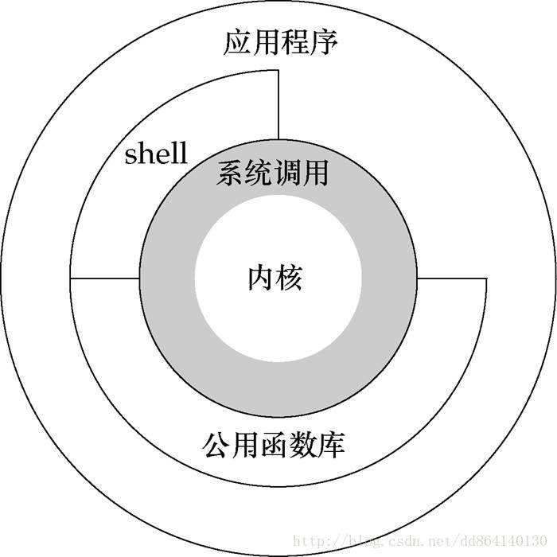

# UNIX基础知识

## UNIX体系结构

**内核**：控制计算机硬件资源，提供程序运行环境。

**系统调用**：内核的接口。

**公用函数库**：构建在系统调用接口之上。

**应用程序**：既可使用公用库函数，也可使用系统调用。

**shell**：一种特殊的应用程序，为运行其他应用程序提供了一个接口。

**Linux**：GNU操作系统使用的内核。



## 输入和输出

**文件描述符**：通常是一个小的非负整数，当内核打开一个现有文件或者创建一个新文件时，它都返回一个文件描述符。

**标准输入、标准输出、标准错误**：3个文件描述符，通常都链接向终端。

**不带缓冲的I/O**：函数open、read、write、lseek、close提供不带缓冲的I/O，它们都使用文件描述符。

**标准I/O**：为不带缓冲的I/O函数提供了一个带缓冲的接口，使用标准I/O函数无需担心如何选取最佳的缓冲区大小。

## 程序和进程

**程序**：一个存储在磁盘上某个目录中的可执行文件。

**进程**：程序的执行实例。

**进程ID**：每个进程都有唯一的数字标识符。

**进程控制**：fork(创建)、exec(执行)、waitpid(等待)。

## 出错处理

**errno**：整型变量，通常被设置为具有特定信息的值。POSIX和ISO C将errno定义为一个符号，它扩展成为一个可修改的整型左值。它可以是一个包含出错编号的整数，也可以是一个返回出错编号指针的函数。

```c
extern int errno;
```

