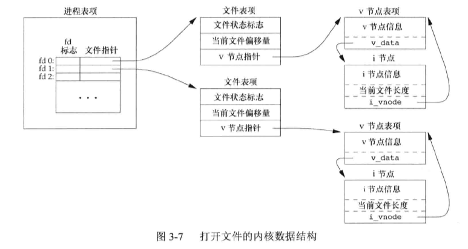

# 文件I/O

## 文件描述符

**STDIN_FILENO**：标准输入文件描述符

**STDOUT_FILENO**：标准输出文件描述符

**STDERR_FILENO**：标准错误文件描述符

## 文件I/O函数

```c
/**
 * @brief: 打开或者创建一个文件
 * @param[in] path: 要打开或创建文件的名字
 * @param[in] oflag: 功能参数
 * @param[in] mode: 指定该新文件的访问权限
 * @return: 若成功，返回文件描述符；若出错，返回-1
 */
#include <fcntl.h>
int open(const char *path, int oflag, ... /* mode_t mode */);

/**
 * @brief: 让线程可以使用相对路径名打开目录中的文件
 * @param[in] fd: 通过打开相对路径名所在的目录来获取
 * @param[in] path: 要打开或创建文件的名字
 * @param[in] oflag: 功能参数
 * @param[in] mode: 指定该新文件的访问权限
 * @return: 若成功，返回文件描述符；若出错，返回-1
 */
#include <fcntl.h>
int openat(int fd, const char *path, int oflag, ... /* mode_t mode */)

/**
 * @brief: 以只写方式打开所创建的文件
 * @param[in] path: 要创建文件的名字
 * @param[in] mode: 指定该新文件的访问权限
 * @return: 若成功，返回为只写打开的文件描述符；若出错，返回-1
 */
#include <fcntl.h>
int creat(const char *path, mode_t mode);

/**
 * @brief: 关闭一个打开文件
 * @param[in] fd: 要关闭的文件的文件描述符
 * @return: 若成功，返回0；若出错，返回-1
 */
#include <unistd.h>
int close(int fd);

/**
 * @brief: 显式地为一个打开文件设置偏移量
 * @param[in] fd: 文件描述符
 * @param[in] offset: 偏移量
 * @param[in] whence: 偏移计算位置
 * @return: 若成功，返回新的文件偏移量；若出错，返回-1
 */
#include <unistd.h>
off_t lseek(int fd, off_t offset, int whence);

/**
 * @brief: 从打开文件中读数据
 * @param[in] fd: 文件描述符
 * @param[out] buf: 读出的数据
 * @param[in] nbytes: 需要读的字节数
 * @return: 读到的字节数，若已到文件尾，返回0；若出错，返回-1
 */
#include <unistd.h>
ssize_t read(int fd, void *buf, size_t nbytes);

/**
 * @brief: 向打开文件写数据
 * @param[in] fd: 文件描述符
 * @param[in] buf: 将要写入的数据
 * @param[in] nbytes: 将要写入的字符数
 * @return: 若成功，返回已写的字节数；若出错，返回-1
 */
#include <unistd.h>
ssize_t write(int fd, const void *buf, size_t nbytes);
```

## 文件共享

​		内核使用3种数据结构表示打开文件，它们之间的关系决定了在文件共享方面一个进程对另一个进程可能产生的影响。

* 每一个进程在进程表中都有一个记录项；
* 内核为所有打开文件维持一张文件表；
* 每个打开文件(或设备)都有一个v节点(v-node)结构。



## 原子操作

​		指的是由多步组成的一个操作。如果该操作原子地执行，则要么执行完所有步骤，要么一步也不执行，不可能只执行所有步骤的一个子集。

```c
/**
 * @brief: 从打开文件的指定偏置处读数据
 * @param[in] fd: 文件描述符
 * @param[out] buf: 读出的数据
 * @param[in] nbytes: 需要读的字节数
 * @return: 读到的字节数，若已到文件尾，返回0；若出错，返回-1
 */
#include <unistd.h>
ssize_t pread(int fd, void *buf, size_t nbytes, off_t offset);

/**
 * @brief: 向打开文件的指定偏置处写数据
 * @param[in] fd: 文件描述符
 * @param[in] buf: 将要写入的数据
 * @param[in] nbytes: 将要写入的字符数
 * @return: 若成功，返回已写的字节数；若出错，返回-1
 */
#include <unistd.h>
ssize_t pwrite(int fd, const void *buf, size_t nbytes, off_t offset);

/**
 * @brief: 复制一个现有的文件描述符;返回的新文件描述符一定是当前可用文件描述符中的最小数值
 * @param[in] fd: 文件描述符
 * @return: 若成功，返回新的文件描述符；若出错，返回-1
 * @example: dup(fd);相当于fcntl(fd, F_DUPFD, 0);
 */
#include <unistd.h>
int dup(int fd);

/**
 * @brief: 复制一个现有的文件描述符
 * @param[in] fd: 文件描述符
 * @param[in] fd2: 指定新文件描述符
 * @return: 若成功，返回新的文件描述符；若出错，返回-1
 * @example: dup2(fd, fd2);相当于close(fd2);fcntl(fd, F_DUPFD, fd2);
 */
#include <unistd.h>
int dup2(int fd, int fd2);
```

## 缓冲同步

```c
/**
 * @brief: 同步文件描述符指定的文件信息
 * @param[in] fd: 文件描述符
 * @return: 若成功，0；若出错，返回-1
 */
#include <unistd.h>
int fsync(int fd);

/**
 * @brief: 同步文件描述符指定的文件数据
 * @param[in] fd: 文件描述符
 * @return: 若成功，0；若出错，返回-1
 */
#include <unistd.h>
int fdatasync(int fd);

/**
 * @brief: 只将所有修改过的块缓冲区排入写队列，然后就返回，它并不等待实际写磁盘操作结束。
 */
#include <unistd.h>
void sync(void);
```

## 文件属性控制

**fcntl**函数：能够改变已经打开文件的属性。

* 复制一个已有的文件描述符(cmd=F_DUPFD或F_DUPFD_CLOEXEC)
* 获取/设置文件描述符标志(cmd=F_GETFD或F_SETFD)
* 获取/设置文件状态标志(cmd=F_GETFL或F_SETFL)
* 获取/设置异步I/O所有权(cmd=F_GETOWN或F_SETOWN)
* 获取/设置记录锁(cmd=F_GETLK、F_SETLK或F_SETLKW)

```c
/**
 * @brief: 改变已经打开文件的属性
 * @param[in] fd: 文件描述符
 * @param[in] cmd: 控制命令
 * @param[in] arg: cmd对应参数
 * @return: 若成功，则依赖于cmd; 若出错，返回-1
 */
#include <fcntl.h>
int fcntl(int fd, int cmd, ... /* int arg */);
```

